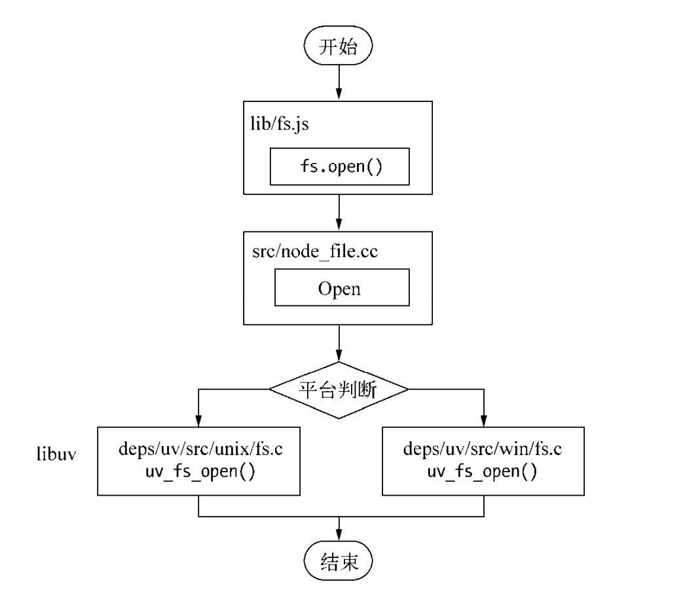
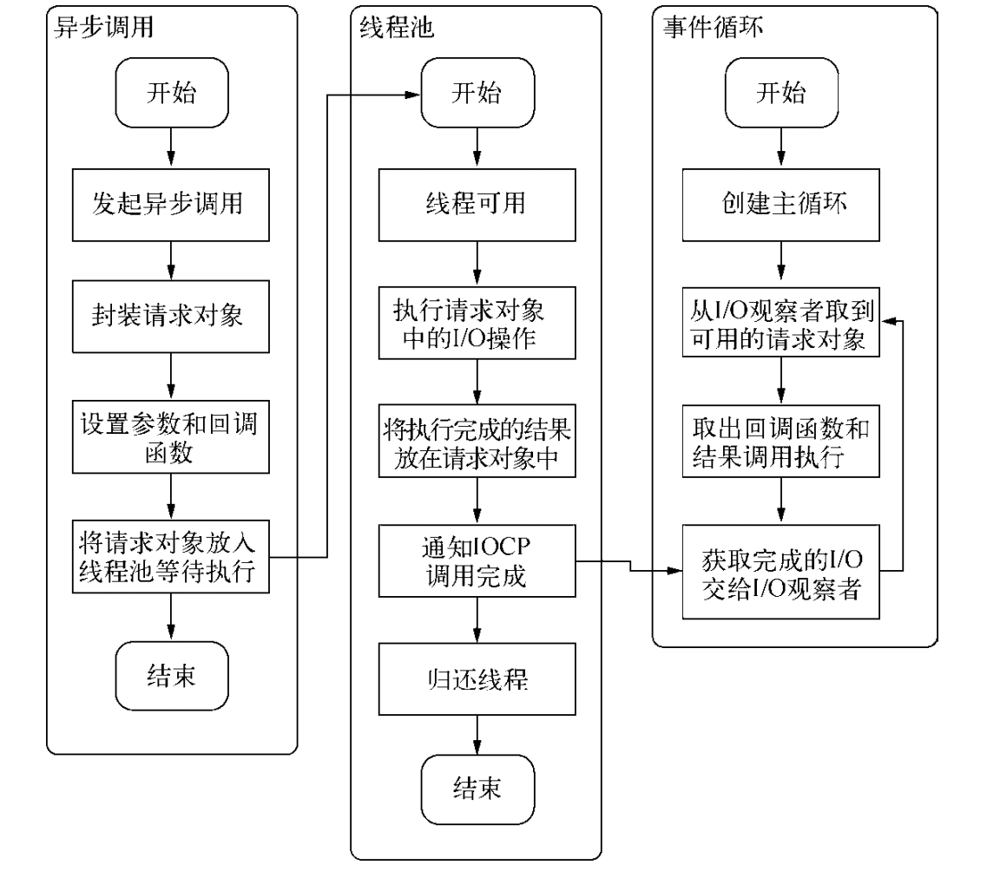

# Node的异步IO

## 事件循环
在进程启动时，Node便会创建一个类似于while(True)的循环，每执行一次循环体的过程我们成为Tick。每个Tick的过程就是查看是否有事件待处理，如果有，就取出来事件以及相关的回调函数。如果存在关联的回调函数，就执行他们。然后进入下个循环，如果不再有事件处理，则退出程序。

## 观察者
在每个Tick的过程中，如何判断是否有事件需要处理呢，这里要引入的概念是观察者。
每个事件循环中有一个或者多个观察者，而判断是否有事件要处理的过程就是向这些观察者询问是否有要处理的事件。
浏览器采用了类似的机制。事件可能来自用户的点击或者加载某些文件时产生，而这些产生的事件都有对应的观察者。在Node中，事件主要来源于网络请求、文件1/0等，这些事件对应的观察者有文件1/O观察者、网络1/O观察者等。观察者将事件进行了分类。
事件循环是一个典型的生产者/消费者模型。异步1/0、网络请求等则是事件的生产者，源源不断为Node提供不同类型的事件，这些事件被传递到对应的观察者那里，事件循环则从观察者那里取出事件并处理。
在Windows下，这个循环基于IOCP创建，而在*nix下则基于多线程创建。

## 请求对象
对于一般的（非异步）回调函数，函数由我们自行调用，如下所示：
```javascript
var forEach = function(list, callback){
    for(var i = 0;i < list.length; i++){
        callback(list[i], i, list);
    }
}
```
对于Node中的异步IO调用而言，回调函数却不由开发者来调用。那么我们从发出调用后，到回调函数被执行，中间发生了什么？
实际上，Javascript发起调用到内核执行完IO操作的过渡过程中，存在一种中间产物，他叫做请求对象。
以fs.open()为例，看看如何被调用
```javascript
fs.open = function(path, flags, mode, callback){
    // ...
    binding.open(pathModule._makeLong(path),
                 stringToFlags(flags),
                 mode,
                 callback);
};
```
fs.open()的作用是根据指定路径和参数打开一个文件，从而得到文件描述符，这是后续所有IO操作的初始操作。从代码中可以看到，js层面的代码通过调用C++核心模块进行下层的操作。

从js调用Node的核心模块，核心模块调用C++内建模块，内建模块通过libuv进行系统调用，这是Node最经典的调用方法。在使用uv_fs_open()的调用过程中，我们创建了一个FSReqWrap请求对象。从js层传入的参数和当前方法都被封装到了这个请求对象中，其中回调函数则被设置在这个对象的oncomplete_sym属性上：
    req_wrap -> object_ -> Set(oncomplete_sym, callback);
对象包装完毕后，在win下，调用QueueUserWorkItem方法将这个FSReqWrap对象推入线程池中等待执行。
    QueueUserWorkItem(&uv_fs_thread_proc,
                      req,
                      WT_EXECUTEDEFAULT)
QueueUserWorkItem()方法接受三个参数，第一个是将要执行的方法的引用，第二个是引用方法运行时候所需要的参数，第三个是执行的标志。当线程池中有可用线程时，我们调用执行方法，根据传入参数的类型调用相应的底层函数。
至此，js调用立即返回，由js层面发起的异步调用的第一阶段就此结束。js线程可以继续执行当前任务的后续操作。当前的IO操作就在线程池里面等待执行，不管他是否阻塞IO都不会影响到js线程的后续执行，就达到了异步的目的
请求对象是异步IO过程中的重要中间产物，所有的状态都保存在这个对象中，包括送入线程池等待执行以及IO操作完毕后的回调函数。

## 执行回调
组装好请求对象，送入IO线程池等待执行，实际上完成异步IO的第一部分，回调通知是第二部分。
线程池中的IO操作调用完毕之后，会将结果存储在req->result属性上，然后调用PostQueuedCompletionStatus()通知IOCP，告知当前对象操作完毕：
    PostQueuedCompletionStatus((loop)->iocp, o, o, &((req)->overlapped))
这个方法的作用是向IOCP提交执行状态，并将线程归还线程池。通过方法提交的状态，可以通过GetQueuedCompletionStatus()提取。
这个过程中，还动用了事件循环的IO观察者，在每次Tick的执行中，他会调用IOCP相关的GetQueuedCompletionStatus()方法检查线程池是否有执行完的请求，如果存在，会将请求对象加入到IO观察者队列中，然后将其当做事件处理。
IO观察者回调函数的行为就是取出请求对象的result属性作为参数，取出oncomplete_sym属性作为方法，然后调用执行，以此达到调用Javascript中传入的回调函数的目的.
流程如下所示：
