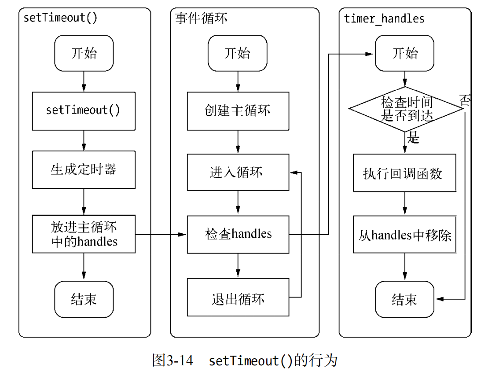

# 非IO的异步API
Node中其实还存在一些与1/O无关的异步API，这一部分也值得略微关注一下，它们分别是setTimeout（）、setInterval（）、setImmediate（）和process.nextTick（）
## setTimeout() 和 setInterval()
setTimeout（）和setInterval（）与浏览器中的API是一致的，分别用于单次和多次定时执行任务。它们的实现原理与异步1/O比较类似，只是不需要1/0线程池的参与。调用setTimeout（）或者setInterval（）创建的定时器会被插入到定时器观察者内部的一个红黑树中。每次Tick执行时，会从该红黑树中迭代取出定时器对象，检查是否超过定时时间，如果超过，就形成一个事件，它的回调函数将立即执行。
定时器的问题在于，它并非精确的（在容忍范围内）。尽管事件循环十分快，但是如果某一次循环占用的时间较多，那么下次循环时，它也许已经超时很久了。譬如通过setTimeout（）设定一个任务在10毫秒后执行，但是在9毫秒后，有一个任务占用了5毫秒的CPU时间片，再次轮到定时器执行时，时间就已经过期4毫秒。

## setImmediate()
setImmediate（）方法与process.nextTick（）方法十分类似，都是将回调函数延迟执行。
process.nextTick（）中的回调函数执行的优先级要高于setImmediate（）。这里的原因在于事件循环对观察者的检查是有先后顺序的，process.nextTick（）属于idle观察者，setImmediate（）属于check观察者。在每一个轮循环检查中，idle观察者先于IO观察者，IO观察者先于check观察者。
在具体实现上，process.nextTick（）的回调函数保存在一个数组中，setImmediate（）的结果则是保存在链表中。在行上，process.nextTick（）在每轮循环中会将数组中的回调函数全部执行完，而setImmediate（）在每轮循环中执行链表中的一个回调函数。
## process.nextTick()
在未了解 process.nextTick（）之前，很多人也许为了立即异步执行一个任务，会这样调用setTimeout（）来达到所需的效果：
```javascript
    setTimeout(function(){
        //TODO
    },0)
```
由于事件循环自身的特点，定时器的精确度不够。而事实上，采用定时器需要动用红黑树，创建定时器对象和迭代等操作，而 setTimeout（fn，0）的方式较为浪费性能。实际上，process.nextTick（）方法的操作相对较轻量，具体代码如下：
```javascript
    process.nextTick = function(callback) {
        // on the way out, dont't bother
        // it won't get fired anyway
        if(process._exiting) return;

        if(tickDepth >= process.maxTickDepth){
            maxTickWarn();
        }

        var tock = { callback: callback};
        if(process.domain) tock.domain = process.domain;
        nextTickQueue.push(tock);
        if(nextTickQueue.length){
            process._needTickCallback();
        }
    };
```
每次调用process.nextTick（）方法，只会将回调函数放入队列中，在下一轮Tick时取出执行。
定时器中采用红黑树的操作时间复杂度O（lg（n）），nextTick（）的时间复杂度次O（1）。相较之下，procesS.nextTick（）更高效。