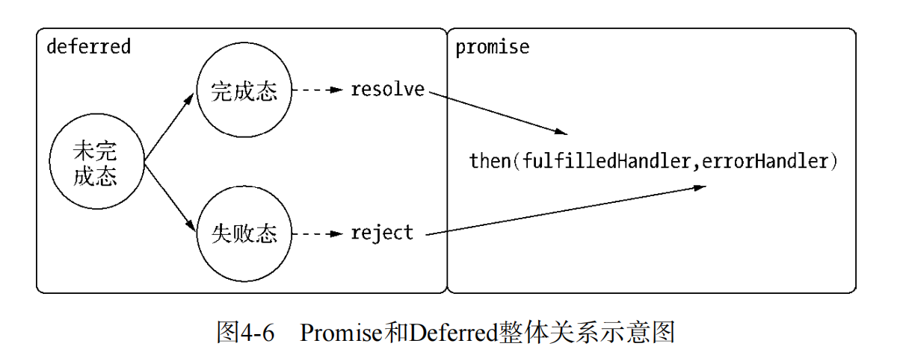

# 异步编程解决方案

## 事件发布/订阅模式
事件侦听器模式是一种广泛用于异步编程的模式，是回调函数的时间话，又称发布/订阅模式。
Node自身提供的events模块是发布/订阅模式的一个简单实现。Node中部分模块都继承自它。他比较简单，具有addListener/on(),once(),removeListener(),removeAllListeners()和emit()等基本的事件侦听模式的方法实现。
```javascript
    //订阅
    emitter.on("event1", function(message)
    {
        console.log(message);
    });
    //发布
    emitter.emit("event1", "I am message")
```
订阅事件就是一个高阶函数的应用。发布订阅模式可以实现一个事件和多个回调函数关联，这些回调函数又称为事件侦听器。通过emit()发布事件后，消息会立刻传递到当前事件的所有侦听起执行。侦听器可以很灵活的添加或者删除，使得事件和具体处理逻辑之间可以很轻松的关联和解耦。
事件发布订阅模式本身并无同步和异步的关系，但在node中，emit()调用多半是伴随事件循环而异步触发的，所以说发布订阅广泛应用于异步编程。
从另一个角度来看，事件侦听器模式也是一种钩子（hook）机制，利用钩子导出内部数据或状态给外部的调用者。Node中的很多对象大多具有黑盒的特点，功能点较少，如果不通过事件钩子的形式，我们就无法取对象在运行期间的中间值或内部状态。这种通过事件钩子的方式，可以使编程者不用关注组件是如何启动和执行的，只需关注在需要的事件点上即可。下面的HTTP请求是典型场景：
```javascript
    var options = {
        host: 'www.google.com',
        port: 80,
        path: '/upload',
        method: 'POST'
    };
    var req = http.request(options, function(res){
        console.log('STATUS' + res.statusCode);
        console.log('HEADERS: ' + JSON.stringify(res.headers));
        res.setEncoding('utf8');
        res.on('data', function(chunk){
            console.log('BODY' + chunk);
        });
        res.on('end', function(){
            // TODO
        });
    });
    req.on('error', function(e){
        console.log('problem with request: ' + e.message);
    });
    // write data to request body
    req.write('data/n')
    req.write('data/n')
    req.end()
```
在这段HTTP请求的代码中，我们只要将视线放在error、data、end这些业务事件点上。

### 回调函数中的 res 对象是谁传入的？

 Node.js 的 http 模块中，当你调用 http.request 方法时，你会传入一个回调函数，这个回调函数会在服务器响应到达时被调用。res 对象是由 Node.js 的 http 模块自动传入的，它是一个 IncomingMessage 对象，代表了 HTTP 响应。

### 侦听器的生命周期
res.on('data', ...) 和 res.on('end', ...) 这两个事件监听器的生命周期与 HTTP 响应流的生命周期密切相关。以下是它们的生命周期和行为：

data 事件
触发时机：data 事件在每次接收到一块数据时触发。HTTP 响应体可能会被分成多个数据块发送，因此 data 事件可能会被多次触发。
生命周期：data 事件监听器会在响应流中有数据可读时被调用。它会一直存在并响应数据块，直到流结束或被显式移除。
结束条件：当响应流结束（即所有数据块都被接收完毕）时，data 事件将不再触发。
end 事件
触发时机：end 事件在响应流的所有数据块都被接收完毕后触发。这标志着响应体的结束。
生命周期：end 事件监听器在流结束时被调用一次。它通常用于执行在接收完整响应后需要进行的操作。
结束条件：end 事件在流结束时触发一次后，不会再触发。
事件监听器的存在
事件监听器会一直存在于流对象上，直到流对象被销毁或者你显式地移除监听器。例如，你可以使用 res.removeListener('data', callback) 来移除特定的监听器。
一旦流结束（即 end 事件触发后），流对象会进入一个非活动状态，通常不会再触发任何事件。
因此，data 和 end 事件监听器的生命周期与响应流的生命周期一致。它们在流结束后不会再触发，但监听器本身会一直存在，直到流对象被销毁或监听器被显式移除。

### 细节点
node在对事件的发布订阅做了一些额外的处理，大多数是从健壮性考虑的。下面为具体的两个细节点：
1. 如果一个事件添加了超过10个侦听器，会被警告，因为可能会导致内存泄漏，可以用emitter.setMaxListeners(0)进行去掉限制，另一方面，由于事件发布会引起一系列侦听器执行，如果相关侦听器过多，会导致过多占用CPU
2. 为了处理异常，EventEmitter对象对error进行了特殊处理，如果运行期间发生了error，则会通过这个侦听器捕获异常，否则则会导致程序退出。

### 继承events模块
```javascript
    var events = require('events');
    function Stream(){
        events.EventEmitter.call(this);
    }
    util.inherits(Stream, events.EventEmitter);
```
Node在util模块中封装了继承的方法，可以这样轻松继承EventEmitter类。利用事件机制解决业务问题。

### 利用事件队列解决雪崩问题
once()方法，通过它添加的侦听器只能执行一次，在执行之后就会将它与事件的关联移除。这个特性可以帮我们解决过滤一些重复性的事件响应。
```javascript
var proxy = new events.EventEmitter(); 
var status = "ready"; 
var select = function (callback) { 
    proxy.once("selected", callback); 
    if (status === "ready") { 
        status = "pending"; 
        db.select("SQL", function (results) { 
            proxy.emit("selected", results); 
            status = "ready"; 
        }); 
    } 
};
```
这里就是将所有请求（调用了select）的回调都压入了事件队列中，利用其执行一次就会将监视器移除的特点，保证每一个回调只会被执行一次。对于相同的SQL语句，保证在同一个查询开始到结束的过程永远只有一次。SQL在查询时，新到来的相同调用只需要在队列中等待数据就绪即可，一旦查询结束，得到的结果可以被这些调用共同使用，节省重复的数据库调用产生的开销。由于Node单线程执行的原因，此处无需担心状态同步的问题。

### 多异步之间的协作方案
在异步编程中，也会出现事件与侦听器一对多或者多对一的情况，也就是说一个业务逻辑可能依赖两个通过回调或者事件传递的结果，回调嵌套过深的原因就是如此。
为了解决上述的问题，我们可以用下面的例子进行举例:
```javascript
    var count = 0; 
    var results = {}; 
    var done = function (key, value) { 
        results[key] = value; 
        count++; 
        if (count === 3) { 
            // 渲染页面
            render(results); 
        }
    }; 
    fs.readFile(template_path, "utf8", function (err, template) { 
        done("template", template); 
    }); 
    db.query(sql, function (err, data) { 
        done("data", data); 
    }); 
    l10n.get(function (err, resources) { 
        done("resources", resources); 
    });
```
由于多个异步场景中回调函数的执行并不能保证顺序，切回调函数没有任何交集，所以要用到第三方的函数与变量进行异步的协作，通常我们把检测次数的变量叫做哨兵变量。

多对一的方法的实现代码：
```javascript
    var after = function (times, callback) { 
        var count = 0, results = {}; 
        return function (key, value) { 
            results[key] = value; 
            count++; 
            if (count === times) { 
                callback(results); 
            } 
        }; 
    }; 
    var done = after(times, render);
```

多对多的方法的实现代码：
```javascript
    var emitter = new events.Emitter(); 
    var done = after(times, render); 

    emitter.on("done", done); 
    emitter.on("done", other); 

    fs.readFile(template_path, "utf8", function (err, template) { 
        emitter.emit("done", "template", template); 
    }); 

    db.query(sql, function (err, data) { 
        emitter.emit("done", "data", data); 
    });
    
    l10n.get(function (err, resources) { 
        emitter.emit("done", "resources", resources); 
    });
```
## Promise/Deferred模式
他是一种先执行异步调用，延迟传递处理的方式。

与事件发布/订阅模式相比，Promise/Deferred模式的API接口和抽象模型都十分简洁。从图中也可以看出，它将业务中不可变的部分封装在了Deferred中，将可变的部分交给了Promise。此时问题就来了，对于不同的场景，都需要去封装和改造其Deferred部分，然后才能得到简清的接口。如果场景不常用，封装花费的时间与带来的简洁相比并不一定划算。

### 支持序列执行的Promise
要让Promise支持链式执行，主要通过以下两个步骤。
（1） 将所有的回调都存到队列中。
（2） Promise完成时，逐个执行回调，一旦检测到返回了新的Promise对象，停止执行，然后将当前Deferred对象的promise引用改变力新的Promise对象，并将队列中余下的回调转交给它。

## 流程控制库

