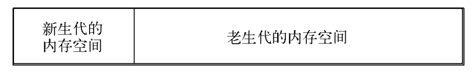

# V8垃圾回收机制和内存机制

## V8内存限制
Node中js使用内存只能使用部分内存。所以无法直接操作大内存对象。

## V8对象分配
在V8中,所有的js对象都是通过堆来进行分配的。Node提供了V8中内存使用量的查看方式

$ node 
> process.memoryUsage(); 
{ rss: 14958592, 
 heapTotal: 7195904, 
 heapUsed: 2821496 }
memoryUsage()返回三个属性,headTotal和headUsed是V8堆内存的使用情况，前者是已经申请到的堆数据，后者是当前使用的量。
当我们代码中声明变量并赋值，所使用对象的内存就分配在堆中，如果已经申请的堆空间内存不够分配新的对象，将继续申请堆内存，直到堆的大小超过V8的限制为止。
至于V8为何要限制堆的大小，表层原因为V8最初浏览器而设计，不太可能遇到用大量内存的场景。对于网页来说，V8的限制值已经绰绰有余。深层原因是V8的垃圾回收机制的限制。
按官方的说法，以1.5 GB的垃圾回收堆内存例，V8做一次小的垃圾回收需要50毫秒以上，做一次非增量式的垃圾回收甚至要1秒以上。这是垃圾回收中引起JavaScript线程暂停执行的时间，在这样的时间花销下，应用的性能和响应能力都会直线下降。这样的情况不仅仅后端服务无法接受，前端浏览器也无法接受。因此，在当时的考虑下直接限制堆内存是一个好的选择。
当然，这个限制也不是不能打开，V8依然提供了选项让我们使用更多的内存。Node在启动时可以传递--max-old-space-size或--max-new-space-size来调整内存限制的大小，示例如下：

node --max-old-space-size=1700 test.js //单位为MB
node --max-new-space-size=1024 test.js // 单位为KB

## 垃圾回收机制
V8的垃圾回收策略主要基于分布式垃圾回收机制。对于不同的对象的生命周期长短不一，不同的算法只能针对特定情况具有最好的效果。

在V8中，主要讲内存分为新生代和老生代两代。新生代对象为存活时间短的对象，老生代对象为存活时间长的对象。

V8堆的整体大小就是新生代所用内存空间加上老生代的内存空间。前面我们提及的--max-old-space-size命令行参数可以用于设置老生代内存空间的最大值，--max-new-space-size命令行参数则用于设置新生代内存空间的大小的。比较遗憾的是，这两个最大值需要在启动时就指定。这意味着V8使用的内存没有办法根据使用情况自动扩充，当内存分配过程中超过极限值时，就会引起进程出错。

### Scavenge算法
新生代中的对象主要通过Scavenge算法进行垃圾回收。
Cheney算法是一种采用复制的方式实现的垃圾回收算法。它将堆内存一分为二，每一部分空间称 semispace。在这两个semispace空间中，只有一个处于使用中，另一个处于闲置状态。处于使用状态的semispace空间称 From空间，处于闲置状态的空间称 To空间。当我们分配对象时，先是在From空间中进行分配。当开始进行垃圾回收时，会检查From空间中的存活对象，这些存活对象将被复制到To空间中，而非存活对象占用的空间将会被释放。完成复制后，From空间和To空间的角色发生对换。简而言之，在垃圾回收的过程中，就是通过将存活对象在两个semispace空间之间进行复制。
Scavenge的缺点是只能使用堆内存中的一半，这是由划分空间和复制机制所决定的。但Scavenge由于只复制存活的对象，并且对于生命周期短的场景存活对象只占少部分，所以它在时间效率上有优异的表现。
由于Scavenge是典型的牺牲空间换取时间的算法，所以无法大规模地应用到所有的垃圾回收中。但可以发现，Scavenge非常适合应用在新生代中，因为新生代中对象的生命周期较短，恰恰适合这个算法。

当一个对象被多次复制时，他会被认为是生命周期较长的对象。他将随后被移动到老生代，用新的算法管理，这种操作叫做晋升。
在单纯的Scavenge过程中，From空间中的存活对象会被复制到To空间中去，然后对From空间和To空间进行角色对换（又称翻转）。但在分代式垃圾回收的前提下，From空间中的存活对象在复制到To空间之前需要进行检查。在一定条件下，需要将存活周期长的对象移动到老生代中，也就是完成对象晋升。
对象晋升的条件主要有两个，一个是对象是否经历过Scavenge回收，一个是To空间的内存占用比超过限制。
在默认情况下，V8的对象分配主要集中在From空间中。对象从From空间中复制到To空间时，会检查它的内存地址来判断这个对象是否已经经历过一次Scavenge回收。如果已经经历过了，会将该对象从From空间复制到老生代空间中，如果没有，则复制到To空间中。

另一个判断条件是To空间的内存占用比。当要从From空间复制一个对象到To空间时，如果To空间已经使用了超过25% ，则这个对象直接晋升到老生代空间中

ps：感觉和java中新生代的操作是一样的。

### Mark-Sweep & Mark-Compact
Mark-Sweep是标记清除的意思，它分为标记和清除两个阶段。与Scavenge相比，Mark-Sweep并不将内存空间划分为两半，所以不存在浪费一半空间的行为。与Scavenge复制活着的对象不同，Mark-Sweep在标记阶段遍历堆中的所有对象，并标记活着的对象，在随后的清除阶段中，只清除没有被标记的对象。可以看出，Scavenge中只复制活着的对象，而Mark-Sweep只清理死亡对象。活对象在新生代中只占较小部分，死对象在老生代中只占较小部分，这是两种回收方式能高效处理的原因。图为Mark-Sweep在老生代空间中标记后的示意图，黑色部分标记死亡的对象。

Mark-Sweep最大的问题是在进行一次标记清除回收后，内存空间会出现不连续的状态。这种内存碎片会对后续的内存分配造成问题，因很可能出现需要分配一个大对象的情况，这时所有的碎片空间都无法完成此次分配，就会提前触发垃圾回收，而这次回收是不必要的。
为了解决Mark-Sweep的内存碎片问题，Mark-Compact被提出来。Mark-Compact是标记整理的意思，是在Mark-Sweep的基础上演变而来的。它们的差别在于对象在标记为死亡后，在整理的过程中，将活着的对象往一端移动，移动完成后，直接清理掉边界外的内存。图次Mark-Compact完成标记并移动存活对象后的示意图，白色格子为存活对象，深色格子为死亡对象，浅色格子为存活对象移动后留下的空洞。

ps:感觉和java一摸一样垃圾回收机制！！

## 查看垃圾回收日志
在启动的时候添加--trace_gc参数可以查看垃圾回收日志
在启动时候添加--prof参数可以看到性能分析数据

