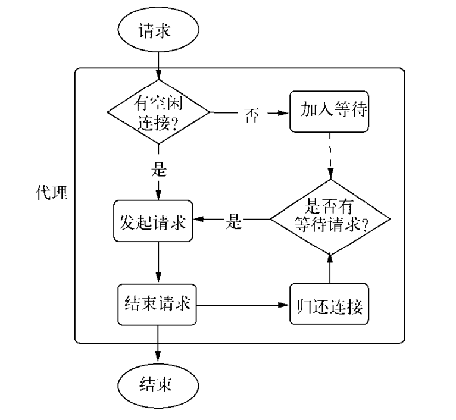

# HTTP
构造一个HTTP服务器
```javascript
var http = require('http'); 
http.createServer(function (req, res) { 
    res.writeHead(200, {'Content-Type': 'text/plain'}); 
    res.end('Hello World\n'); 
}).listen(1337, '127.0.0.1'); 
console.log('Server running at http://127.0.0.1:1337/');
```
## 介绍
HTTP的全称是超文本传输协议，英文写作HyperText Transfer Protocol。欲了解Web，先了解HTTP将会极大地提高我们对Web的认知。HTTP构建在TCP之上，属于应用层协议。在HTTP的两端是服务器和浏览器，即著名的B/S模式，如今精彩纷呈的Web即是HTTP的应用。
HTTP得以发展是W3C和IETF两个组织合作的结果，他们最终发布了一系列RFC标准，目前最知名的HTTP标准内RFC 2616。

## 报文
可以用 curl -v选项现实网络通信的所有报文
报文可以大致分为这几个部分：
第一部分为经典的TCP3次握手
第二部分为客户端向服务器端发送请求报文
第三部分是服务器端处理完后，向客户端发送相应内容，包括响应头和响应体
最后是结束会话的信息

## http模块
node的http模块包含对HTTP处理的封装。http继承于net模块，它能与多个客户端保持连接，采用事件驱动的形式，并不为连接创建额外的线程或者进程，保持很低的内存占用，实现高并发。
http用的套接字的读写对象是ServerRequest和ServerResponse对象，分别对应请求和响应操作。在请求产生的过程中，http模块拿到连接中传来的数据，调用二进制模块http_parser进行解析，在解析完请求报文的报头后，触发request事件，调用用户的业务逻辑。

对于TCP连接的读操作，http模块将其封装ServerRequest对象。让我们再次查看前面的请求报文，报文头部将会通过http_parser进行解析。请求报文的代码如下所示：
> GET / HTTP/1.1 
> User-Agent: curl/7.24.0 (x86_64-apple-darwin12.0) libcurl/7.24.0 OpenSSL/0.9.8r zlib/1.2.5 
> Host: 127.0.0.1:1337 
> Accept: */* 
>

报文头第一行GET / HTTP/1.1被解析之后分解为如下属性。
口 req.method属性：值为GET，是为请求方法，常见的请求方法有GET、POST、DELETE、PUT、CONNECT等几种。
口 req.ur1属性：值为 /。
口 req.httpVersion属性：值为1.1。
其余报头是很规律的Key:Value格式，被解析后放置在req.headers属性上传递给业务逻辑以供调用，如下所示：
headers: {
    'user-agent': 'curl/7.24.0 (x86_64-apple-darwin12.0) libcurl/7.24.0 OpenSSL/0.9.8r zlib/1.2.5', 
    host: '127.0.0.1:1337', 
    accept: '*/*' 
},
报文体部分则抽象一个只读流对象，如果业务逻辑需要读取报文体中的数据，则要在这个数据流结束后才能进行操作，如下所示：
```javascript
function (req, res) { 
    // console.log(req.headers); 
    var buffers = []; 
    req.on('data', function (trunk) { 
        buffers.push(trunk); 
    }).on('end', function () { 
        var buffer = Buffer.concat(buffers); 
        // TODO
        res.end('Hello world'); 
    }); 
}
```

再来看看HTTP响应对象。HTTP响应相对简单一些，它封装了对底层连接的写操作，可以将其看成一个可写的流对象。它影响响应报文头部信息的API res. setHeader（）和 res.writeHead（）。在上述示例中：
res.writeHead(200, {'Content-Type': 'text/plain'});
其分setHeader（）和writeHead（）两个步骤。它在http模块的封装下，实际生成如下报文：
< HTTP/1.1 200 OK 
< Content-Type: text/plain

我们可以用setHeader进行多次设置，但只有调用了writeHead后，报文才能写入到连接中。除此之外，http还会自动帮你设置一些头信息，如下：
< Date: Sat, 06 Apr 2013 08:01:44 GMT 
< Connection: keep-alive 
< Transfer-Encoding: chunked 
<

报文体部分则是调用res.write（）和res.end（）方法实现，后者与前者的差别在于res.end（）会先调用write（）发送数据，然后发送信号告知服务器这次响应结束。
响应结束后，HTTP服务器可能会将当前的连接用于下一个请求，或者关闭连接。值得注意的是，报头是在报文体发送前发送的，一旦开始了数据的发送，writeHead（） 和setHeader（）将不再生效。这由协议的特性决定。
另外，无论服务器端在处理业务逻辑时是否发生异常，务必在结束时调用res.end（）结束请求，否则客户端将一直处于等待的状态。当然，也可以通过延迟res.end（）的方式实现客户端与服务器端之间的长连接，但结束时务必关闭连接。

ps:
    调用 res.end() 后，响应结束。
    在 HTTP/1.1 中，连接可以保持打开以复用，除非明确关闭。
    在 HTTP/1.0 中，连接通常会关闭，需要重新建立连接以发送新请求。

## HTTP服务的事件
如同TCP服务一样，HTTP服务器也抽象了一些事件，以供应用层使用，同样典型的是，服务器也是一个EventEmitter实例。
口 connection事件：在开始HTTP请求和响应前，客户端与服务器端需要建立底层的TCP连接，这个连接可能因为开启了keep-alive，可以在多次请求响应之间使用；当这个连接建立时，服务器触发一次connection事件。
```javascript
const http = require('http');

const server = http.createServer((req, res) => {
  res.end('Hello, world!');
});

server.on('connection', (socket) => {
  console.log('A new TCP connection was made.');
});

server.listen(3000, () => {
  console.log('Server is listening on port 3000');
});
```
口 request事件：建立TCP连接后，http模块底层将在数据流中抽象出HTTP请求和HTTP响应，当请求数据发送到服务器端，在解析出HTTP请求头后，将会触发该事件；在res.end（）后，TCP连接可能将用于下一次请求响应。
```javascript
const http = require('http');

const server = http.createServer();

server.on('request', (req, res) => {
  console.log(`Received request for ${req.url}`);
  res.writeHead(200, { 'Content-Type': 'text/plain' });
  res.end('Hello, world!');
});

server.listen(3000, () => {
  console.log('Server is listening on port 3000');
});
```
口 close事件：与TCP服务器的行一致，调用server.close（）方法停止接受新的连接，当已有的连接都断开时，触发该事件；可以给server.close（）传递一个回调函数来快速注册该事件。
```javascript
const http = require('http');

const server = http.createServer((req, res) => {
  res.end('Hello, world!');
});

server.listen(3000, () => {
  console.log('Server is listening on port 3000');
});

// Close the server after 10 seconds
setTimeout(() => {
  server.close(() => {
    console.log('Server has closed');
  });
}, 10000);

server.on('close', () => {
  console.log('Server close event triggered');
});
```
口 checkContinue事件：某些客户端在发送较大的数据时，并不会将数据直接发送，而是先发送一个头部带Expect:100-continue的请求到服务器，服务器将会触发checkContinue事件；如果没有为服务器监听这个事件，服务器将会自动响应客户端100 Continue的状态码，表示接受数据上传；如果不接受数据的较多时，响应客户端400 Bad Request拒绝客户端继续发送数据即可。需要注意的是，当该事件发生时不会触发request事件，两个事件之间互斥。当客户端收到100 Continue后重新发起请求时，才会触发request事件。
```javascript
const http = require('http');

const server = http.createServer();

server.on('checkContinue', (req, res) => {
  console.log('Received a 100-continue request');
  res.writeContinue(); // Send 100 Continue response
  res.end('Request processed');
});

server.listen(3000, () => {
  console.log('Server is listening on port 3000');
});
```
口 connect事件：当客户端发起CONNECT请求时触发，而发起CONNECT请求通常在HTTP代理时出现；如果不监听该事件，发起该请求的连接将会关闭。
```javascript
const http = require('http');

const server = http.createServer();

server.on('connect', (req, socket, head) => {
  console.log('Received a CONNECT request');
  socket.write('HTTP/1.1 200 Connection Established\r\n\r\n');
  socket.end();
});

server.listen(3000, () => {
  console.log('Server is listening on port 3000');
});
```
口 upgrade事件：当客户端要求升级连接的协议时，需要和服务器端协商，客户端会在请求头中带上Upgrade字段，服务器端会在接收到这样的请求时触发该事件。如果不监听该事件，发起该请求的连接将会关闭。
```javascript
const http = require('http');

const server = http.createServer();

server.on('upgrade', (req, socket, head) => {
  console.log('Received an upgrade request');
  socket.write('HTTP/1.1 101 Switching Protocols\r\n' +
               'Upgrade: websocket\r\n' +
               'Connection: Upgrade\r\n' +
               '\r\n');
  socket.pipe(socket); // Echo back
});

server.listen(3000, () => {
  console.log('Server is listening on port 3000');
});
```
口 clientError事件：连接的客户端触发error事件时，这个错误会传递到服务器端，此时触发该事件。
```javascript
const http = require('http');

const server = http.createServer();

server.on('clientError', (err, socket) => {
  console.error('Client error:', err);
  socket.end('HTTP/1.1 400 Bad Request\r\n\r\n');
});

server.listen(3000, () => {
  console.log('Server is listening on port 3000');
});
```
## HTTP客户端
如同服务器端的实现一般，http提供的ClientRequest对象也是基于TCP层实现的，在keepalive的情况下，一个底层会话连接可以多次用于请求。了重用TCP连接，http模块包含一个默认的客户端代理对象http.globalAgent。它对每个服务器端（host+port）创建的连接进行了管理，默认情况下，通过ClientRequest对象对同一个服务器端发起的HTTP请求最多可以创建5个连接。它的实质是一个连接池.如下图所示：


与服务器端对应的，HTTP客户端也有相应的事件。
口 response：与服务器端的request事件对应的客户端在请求发出后得到服务器端响应时，会触发该事件。
口 socket：当底层连接池中建立的连接分配给当前请求对象时，触发该事件。
口 connect：当客户端向服务器端发起CONNECT请求时，如果服务器端响应了200状态码，客户端将会触发该事件。
口 upgrade：客户端向服务器端发起Upgrade请求时，如果服务器端响应了101 SwitchingProtocols状态，客户端将会触发该事件。
口 continue：客户端向服务器端发起Expect:100-continue头信息，以试图发送较大数据量，
如果服务器端响应100 Continue状态，客户端将触发该事件。