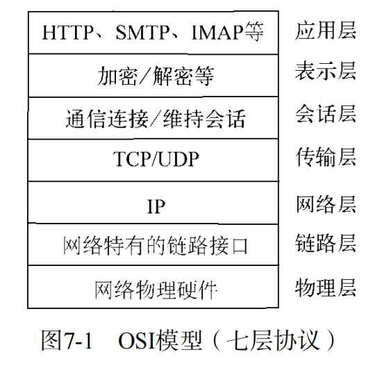

# TCP
TCP全名传输控制协议，在OSI模型（由七层组成，分别物理层、数据链结层、网络层、传输层、会话层、表示层、应用层）中属于传输层协议。许多应用层协议基于TCP构建，典型的是HTTP、SMTP、IMAP等协议。

TCP是面向连接的协议，其特征是传输之前要进行三次握手形成会话。
## 创建一个TCP服务器端
tcp-server.js

## TCP服务事件
### 服务器事件
口 listening：在调用server.listen（）绑定端口或者Domain Socket后触发，简洁写法为server.listen（port,listeningListener），通过listen（）方法的第二个参数传入。
```javascript
var net = require('net');
var server = net.createServer((socket) => {
    // 处理连接
});
server.listen(1337, '127.0.0.1', () => {
    console.log('服务器正在监听 127.0.0.1:1337');
});
```
口 connection：每个客户端套接字连接到服务器端时触发，简洁写法通过net.create-Server（），最后一个参数传递。
```javascript
var net = require('net');

var server = net.createServer((socket) => {
    console.log('新的客户端连接');
    socket.write('欢迎连接到服务器\r\n');
});

server.listen(1337, '127.0.0.1');
```
口 close：当服务器关闭时触发，在调用server.close（）后，服务器将停止接受新的套接字连接，但保持当前存在的连接，等待所有连接都断开后，会触发该事件。
```javascript
var net = require('net');

var server = net.createServer((socket) => {
    // 处理连接
});

server.on('close', () => {
    console.log('服务器已关闭');
});

server.listen(1337, '127.0.0.1');

// 关闭服务器
setTimeout(() => {
    server.close();
}, 10000); // 10秒后关闭服务器

```
口 error：当服务器发生异常时，将会触发该事件。比如侦听一个使用中的端口，将会触发一个异常，如果不侦听error事件，服务器将会抛出异常。
```javascript
var net = require('net');

var server = net.createServer((socket) => {
    // 处理连接
});

server.on('error', (err) => {
    console.error('服务器发生错误:', err);
});

server.listen(1337, '127.0.0.1');

```

### 连接事件
服务器可以同时与多个客户端保持连接，对于每个连接而言是典型的可写可读Stream对象。Stream对象可以用于服务器端和客户端之间的通信，既可以通过data事件从一端读取另一端发来的数据，也可以通过write（）方法从一端向另一端发送数据。它具有如下自定义事件。
口 data：当一端调用write（）发送数据时，另一端会触发data事件，事件传递的数据即是write（）发送的数据。
```javascript
var net = require('net');

var server = net.createServer((socket) => {
    socket.on('data', (data) => {
        console.log('收到数据:', data.toString());
        socket.write('你发送了: ' + data);
    });
});

server.listen(1337, '127.0.0.1');

```
口 end：当连接中的任意一端发送了FIN数据时，将会触发该事件。
```javascript
var net = require('net');

var server = net.createServer((socket) => {
    socket.on('end', () => {
        console.log('客户端连接已结束');
    });
});

server.listen(1337, '127.0.0.1');

```
口 connect：该事件用于客户端，当套接字与服务器端连接成功时会被触发。
```javascript
var net = require('net');

var client = net.createConnection({ port: 1337, host: '127.0.0.1' }, () => {
    console.log('已连接到服务器');
    client.write('你好，服务器!');
});

client.on('data', (data) => {
    console.log('收到:', data.toString());
});

client.on('end', () => {
    console.log('断开与服务器的连接');
});

```
口 drain：当任意一端调用write（）发送数据时，当前这端会触发该事件。
```javascript
var net = require('net');

var server = net.createServer((socket) => {
    socket.on('drain', () => {
        console.log('数据已发送完毕，可以继续写入');
    });

    // 模拟大量数据写入
    for (let i = 0; i < 1000; i++) {
        socket.write('数据块 ' + i);
    }
});

server.listen(1337, '127.0.0.1');

```
口 error：当异常发生时，触发该事件。
```javascript
var net = require('net');

var server = net.createServer((socket) => {
    socket.on('error', (err) => {
        console.error('连接发生错误:', err);
    });
});

server.listen(1337, '127.0.0.1');

```
口 close：当套接字完全关闭时，触发该事件。
```javascript
var net = require('net');

var server = net.createServer((socket) => {
    socket.on('close', () => {
        console.log('连接已完全关闭');
    });
});

server.listen(1337, '127.0.0.1');

```
口 timeout：当一定时间后连接不再活跃时，该事件将会被触发，通知用户当前该连接已经被闲置了。
```javascript
var net = require('net');

var server = net.createServer((socket) => {
    socket.setTimeout(5000); // 设置超时时间为5秒

    socket.on('timeout', () => {
        console.log('连接超时');
        socket.end();
    });
});

server.listen(1337, '127.0.0.1');

```
