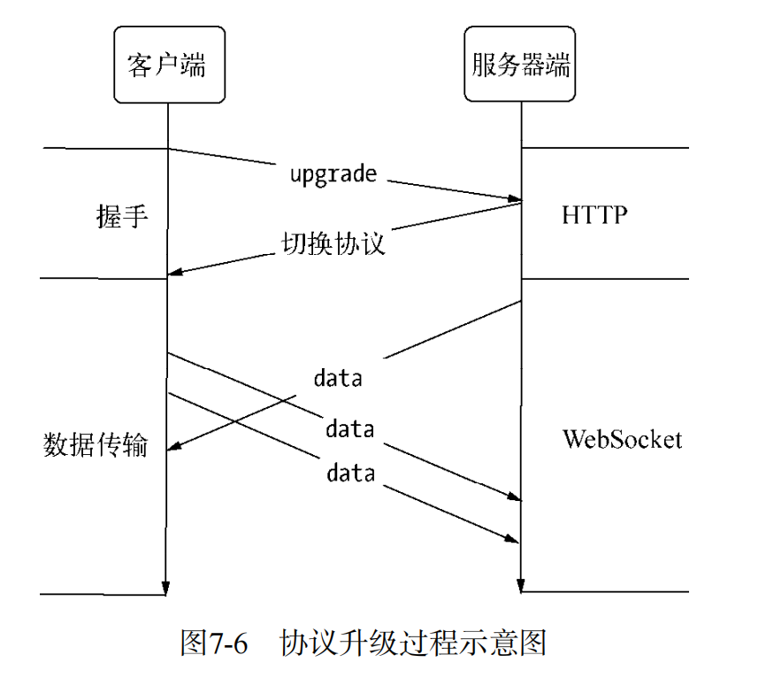

# WebSocket
提到Node，不能错过的是WebSocket协议。它与Node之间的配合堪称完美，其理由有两条。
口 WebSocket客户端基于事件的编程模型与Node中自定义事件相差无几。
口 WebSocket实现了客户端与服务器端之间的长连接，而Node事件驱动的方式十分擅长与大量的客户端保持高并发连接。

websocket和http都有的好处：
口 客户端与服务器端只建立一个TCP连接，可以使用更少的连接。
口 WebSocket服务器端可以推送数据到客户端，这远比HTTP请求响应模式更灵活、更高效。
口 有更轻量级的协议头，减少数据传送量。

使用WebSocket的话，网页客户端只需一个TCP连接即可完成双向通信，在服务器端与客户端频繁通信时，无须频繁断开连接和重发请求。连接可以得到高效应用，编程模型也十分简洁。
相比HTTP，WebSocket更接近于传输层协议，它并没有在HTTP的基础上模拟服务器端的推送，而是在TCP上定义独立的协议。让人迷惑的部分在于WebSocket的握手部分是由HTTP完成的，使人觉得它可能是基于HTTP实现的。
WebSocket协议主要分为两个部分：握手和数据传输。

## WebSocket握手

## WebSocket数据传输

